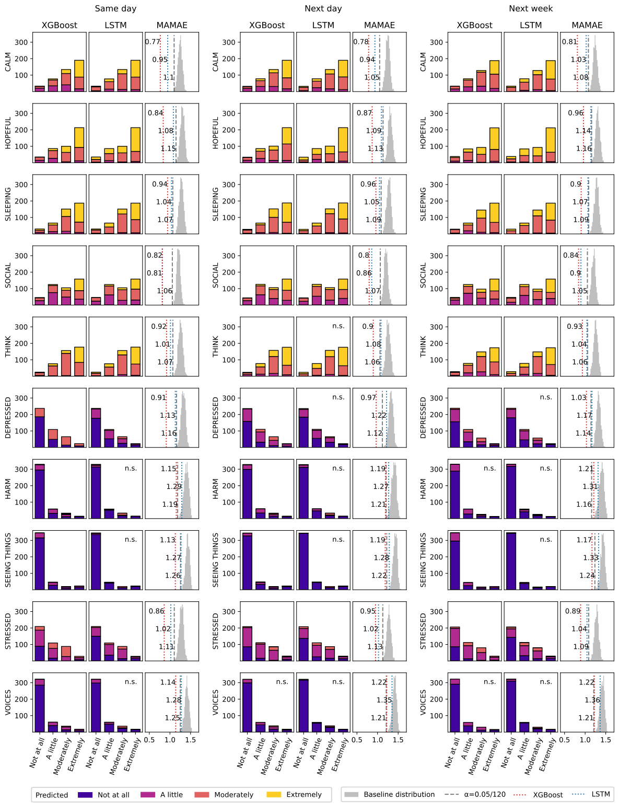

# Ordinal forecasting for digital phenotyping data
Accompanying repository for the paper *Forecasting mental states in schizophrenia using digital phenotyping data*

## Repository structure
- `src/` hosts the code for XGBoost and LSTM models and the analysis pipeline for data preprocessing, model training and evaluation, and post-hoc statistics.
- `scripts/` includes 4 scripts to execute the analysis pipelines.
- `results/` contains the models' evaluation performance and figures.

## Installation
Create a new environment using Python 3.10, then install requirements via

`pip install -r requirements.txt`

## Tooling
- Data transformations use [pandas](https://pandas.pydata.org/docs/index.html), [numpy](https://numpy.org/doc/stable/index.html), and [scikit-learn](https://scikit-learn.org/stable/index.html)
- The analysis pipelines are defined using [Hamilton](https://hamilton.dagworks.io/en/latest/) and runs are managed using [Hydra](https://hydra.cc/docs/configure_hydra/intro/).
- The [XGBoost](https://xgboost.readthedocs.io/en/stable/python/index.html) library is used for gradient boosted decision trees and an ordinal implementation is defined following the scikit-learn API.
- The LSTM is implemented using [PyTorch Lightning](https://lightning.ai/docs/pytorch/stable/) with the CORN architecture from [coral-pytorch](https://github.com/Raschka-research-group/coral-pytorch) and metrics are tracked using [Torchmetrics](https://torchmetrics.readthedocs.io/en/stable/).
- Evaluation metrics from [imbalance-learn](https://imbalanced-learn.org/stable/index.html) are used and statistical testing is done with [scipy](https://docs.scipy.org/doc/scipy/reference/stats.html) and [scikit-posthocs](https://scikit-posthocs.readthedocs.io/en/latest/index.html).